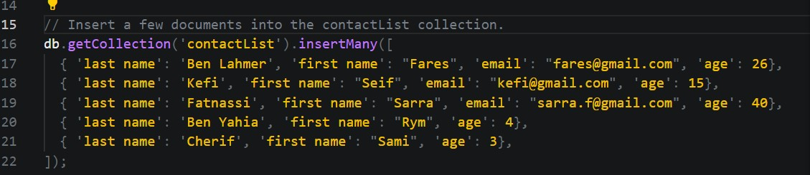
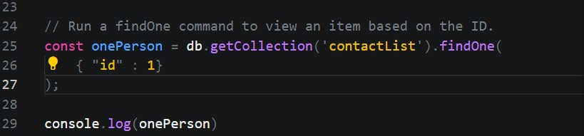
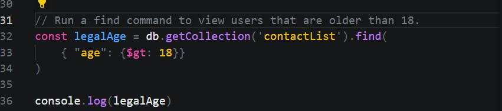
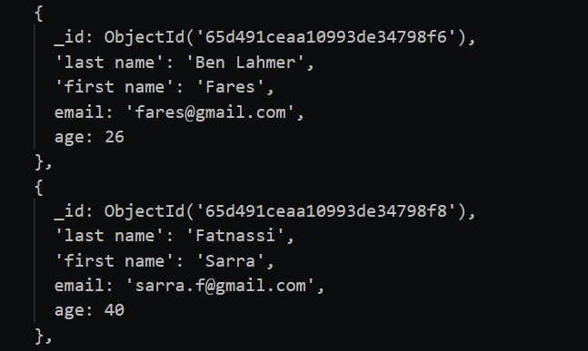
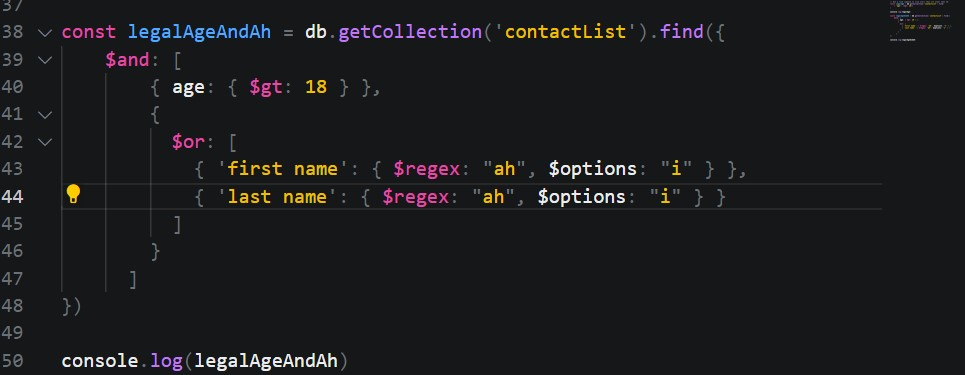
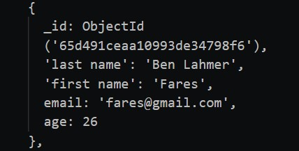
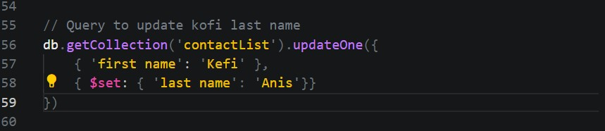
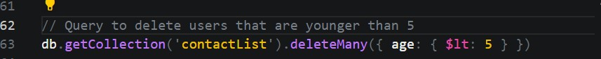
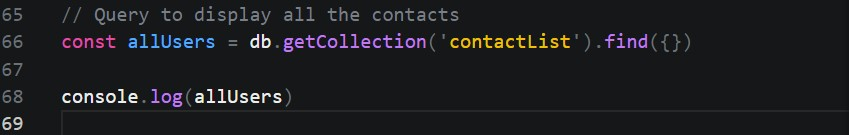

# Screenshots containing the steps done

- ### Insert documents  in "contactlist" collection

- ### Display all the information about only one person using his ID.

- ### Display all the contacts with an age >18.

> Result

- ### Display all the contacts with an age>18 and name containing "ah".

> Result

- ### Change the contact's first name from"Kefi Seif" to "Kefi Anis".

- ### Delete the contacts that are aged under <5.

- ### Display all of the contacts list.

